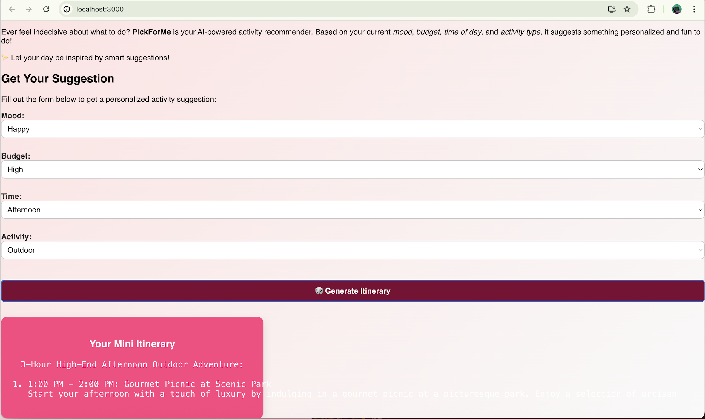

# PickForMe

**PickForMe** is your AI-powered activity recommender. Based on your current **mood**, **budget range**, **time of day**, and **activity type**, it suggests something fun and personalized for you to do. Whether you’re bored, tired, or excited — PickForMe helps spark ideas effortlessly!

---

## ✨ Features

- 🔮 AI-generated activity recommendations
- ⚛️ React frontend
- 🐍 Flask backend powered by OpenAI
- 🔐 Secure API key handling via `.env`
- 🌐 CORS-enabled backend for smooth integration

---

## 🖼️ Demo

Here's what the app looks like(work in progress):




---

## 🧰 Tech Stack

| Layer         | Tools & Technologies              |
|---------------|----------------------------------|
| **Frontend**  | React.js, HTML/CSS (Flexbox/Grid) |
| **Backend**   | Flask, Python                     |
| **AI Engine** | OpenAI GPT-3.5 Turbo              |
| **Styling**   | CSS Modules                       |
| **CORS**      | Flask-CORS                        |
| **Env Config**| `python-dotenv`                   |

---

## 📁 Project Structure

```plaintext
PickForMe/
├── client/                     # React frontend
│   ├── public/
│   ├── src/
│   │   ├── App.js              # Main React app
│   │   ├── App.css             # Component-specific styles
│   │   ├── styles.css          # Shared styles
│   └── package.json
│
├── server/                    # Flask backend
│   ├── app.py                 # Flask entrypoint
│   ├── route.py               # API route logic
│   ├── requirements.txt       # Python dependencies
│   └── .env                   # API key storage (not tracked by Git)
│
├── assets/                   # Images and screenshots
│   └── pickforme-demo.png
│
├── .gitignore
└── README.md
